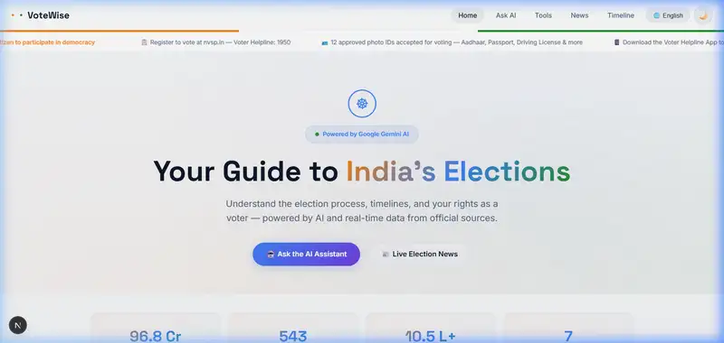
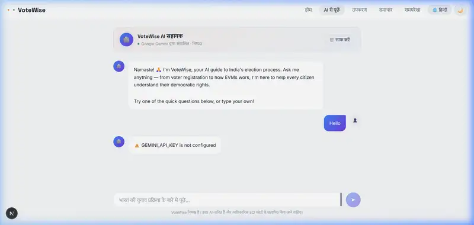
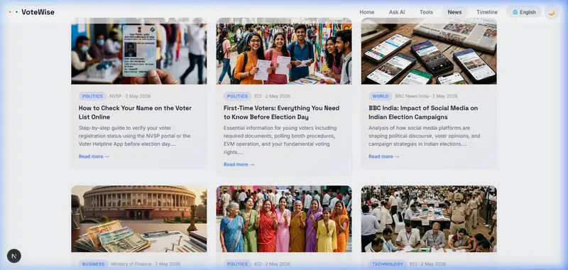
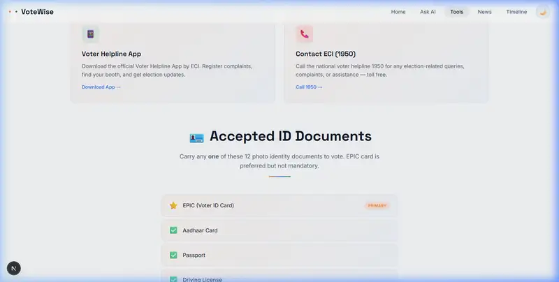

# VoteWise India 🇮🇳

VoteWise India is a multilingual, AI-powered election assistant designed to educate and empower Indian voters. Built specifically for the **Promptswar Hackathon**.

## 🌟 Features

- **🗣️ Multilingual Accessibility**: Full support for 14 Indian languages, ensuring voters across the nation can access vital information.
- **🤖 Gemini AI Chat**: A nonpartisan AI guide capable of explaining the Model Code of Conduct, NOTA, EVM usage, and polling booth rules.
- **📰 Live Election News**: Dynamic fetching of the latest political news, tailored with relevant images to keep voters informed.
- **⚡ Premium UI**: Built with Next.js and styled with culturally resonant Indian-flag themes and seamless dark/light modes.

## 🎯 Hackathon Submission Details

### 1. Chosen Vertical
**Smart Citizen & Governance / Election Assistant Persona**
This project directly targets the enhancement of voter education and participation by acting as an unbiased, highly accessible digital polling assistant.

### 2. Approach and Logic
The core logic revolves around bridging the information gap for diverse Indian voters. 
- **Accessibility-First**: By implementing a 14-language localization engine, the assistant ensures language is not a barrier to democratic participation.
- **Contextual AI**: We integrated the **Google Gemini (`gemini-flash-latest`)** model to provide a conversational interface. The logic prioritizes neutrality, security, and factual alignment with Election Commission of India (ECI) guidelines. 
- **Dynamic Content**: A dual-API news pipeline (GNews & NewsData.io) is implemented with an automatic fallback mechanism to ensure the user always has access to the latest political, technological, and global updates without encountering broken states.

### 3. How the Solution Works
1. **User Onboarding**: The user arrives at the dashboard and immediately selects their preferred regional language. All UI elements instantly localize.
2. **AI Engagement**: Users can interact with the Gemini-powered chat assistant. The prompt logic is strictly constrained to political neutrality and election-related education (e.g., "How do I use an EVM?", "Where is my polling booth?").
3. **Information Consumption**: Users can navigate the live news feed, filterable by categories (Politics, Tech, World), ensuring they stay informed on policy changes and candidate announcements.
4. **Interactive Timeline**: An interactive chronological timeline guides first-time voters through the electoral process step-by-step.

### 4. Assumptions Made
- **API Availability**: Assumes consistent uptime from the free-tier Gemini and News APIs. To mitigate this, a robust hardcoded fallback news system was implemented.
- **Connectivity**: Assumes the user has a baseline internet connection to interface with the AI and live news feeds.
- **ECI Consistency**: Assumes the core electoral procedures (EVM, VVPAT, NOTA) remain fundamentally unchanged for the immediate election cycle the AI advises on.

## 📸 Dashboard Preview

### 🏠 Home Page


### 🤖 AI Chat Assistant (Hindi Example)


### 📰 Live News Feed


### 🛠️ Interactive Voter Tools


## 🚀 Tech Stack

- **Framework**: Next.js 14 App Router
- **AI Integration**: Google Gemini (`@google/genai`)
- **News APIs**: GNews.io and NewsData.io
- **Styling**: Vanilla CSS with localized fonts
- **Deployment**: Google Cloud Run

## 📥 Local Development

```bash
# Install dependencies
npm install

# Run the development server
npm run dev
```

Open [http://localhost:3000](http://localhost:3000) with your browser to see the result.

## 🔒 Configuration

Create a `.env.local` file and add the required API keys:
```env
GEMINI_API_KEY=your_gemini_key_here
GNEWS_API_KEY=your_gnews_key_here
NEWSDATA_API_KEY=your_newsdata_key_here
```
